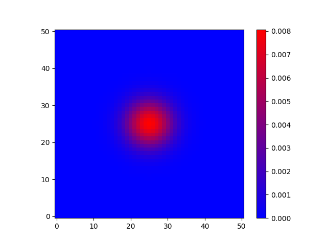
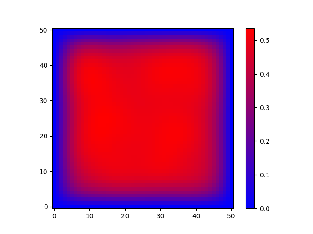

# Fortran_Numerical_Modelling

This is the homework of ETH course.
T: temperature
x,y: direction

## day1-3 ##

Basic Fortran knowledge.

## day4 ##

2D diffusion with initialization of spike and random. 

) 

## day5 ##

2D advection-diffusion with a fixed flow field and zero flux at the boundary x and 0 and 1 at the boundary y. 

) 

Streamfunction：

%20=%20(\frac{\partial%20\psi}{\partial%20y},%20-\frac{\partial%20\psi}{\partial%20x})) 

sin(\frac{\pi%20y}{y_{max}})) 

loop t:\
T(t) -> ψ -> v -> T(t+1)

## day6 ##

Iterative Poisson solver.

## day7 ##

Use Poisson solver for two times for 2D convection-diffusion along time.
With initialization of spike or random, then calculate Poisson-eqs every time step. 
Boundary condition same as in day5.

combine and cancel p related term:

=%20Ra\frac{\partial%20T}{\partial%20x})

Use streamfunction：

=%20Ra\frac{\partial%20T}{\partial%20x})

Then: 

) 

loop t:\
T(t) -> ω(T(t)) -> ψ -> v -> T(t+1)

## day8 ##

2D convection-diffusion along time with vorticity w depending on Prandtl number Pr. \
This is for no so high viscous fluid. When Pr = inf., it returns Poisson equation as in day7.

=\nabla^2%20w%20-%20Ra\frac{\partial%20T}{\partial%20x})

) 

loop t:\
T(t) -> ω(T(t),t) -> ψ -> v -> T(t+1), w(t+1)

## day9 ##

Implicit, semi-implicit diffusion.
